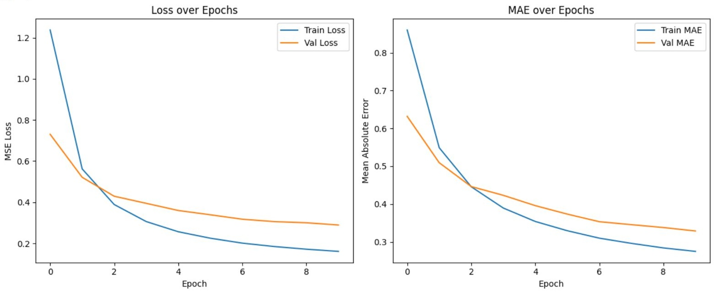
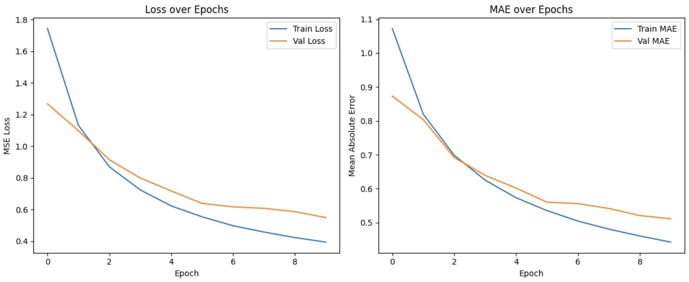
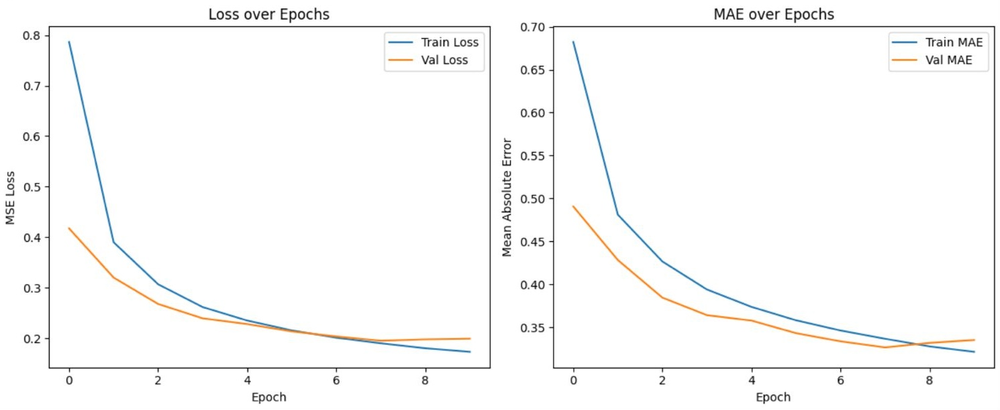
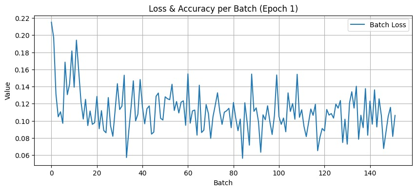

# Rosetta Stone 2

**Course:** Machine Learning 

**University:** Luiss Guido Carli

**Team Members:**  
- Daniele Biggi (793201)
- Ezgim Burcak Akseki (803311)
- Dionne Spaltman (Q00149)

Link to the sharepoint with the csv files: https://luiss-my.sharepoint.com/:f:/g/personal/dionne_spaltman_studenti_luiss_it/EiQz9X4xtYFCiIIqqVgeKJQBlsFhFWYNNqEzw2SiumfFHw?e=4BFULf 

---

## 1. Introduction
The aim of this project was to build a model that is capable of determining how closely related sentences from two different languages  are, a so-called semantic similarity model. To do so, we used a dataset of one million sentence pairs which served as the basis of our project. The first step in creating our model was to process these multilingual sentences. With the preprocessing we went from the input sentences to “base” sentences that only capture the essential meaning. The second step was to augment the dataset. The third step was to build our models: a Transformer model, a RNN with a BiLSTM encoder, a RNN model using embeddings from SentenceTransformer, an ANN model, an ANN model using again the embeddings from SentenceTransformer, and a final ‘streaming’ ANN that uses the same embeddings. We performed experiments and finally, we evaluated our six models. 

## 2. Methods

### 2.1 Dataset Overview
The dataset that was provided, consisted of 5 columns (‘sentence1’, ‘sentence2’, ‘score’, ‘lang1’, lang2’) and 949,080 rows. An example of a sentence is ‘Ein Flugzeug hebt gerade ab’ and its translation would be ‘An air plane is taking off.’ Each pair of sentences has been assigned a score, varying from 0 to 5.

### 2.2 Data Preprocessing
To be able to use our dataset for sentence similarity, we want to get the base form for each of the sentences. To do this, the following steps need to be performed: the text needs to be lowercase; punctuation and special characters need to be removed; sentences have to be tokenized; we apply lemmatization; and finally stop words need to be removed (but only for languages where this makes sense). More specifically, we started by loading the correct language models from Spacy.  A function called ‘spacy_batch_tokenizer’ was created. Then we would load the correct tokenizer based on the language and create an empty list with the end result. In a for loop we would then process the text in batches. The text was made all lowercase and stop words, punctuation and non-alphabetic characters would be excluded. Then the end result would be appended to the result list and finally the list of processed text would be returned. After doing this preparation work, the code was ready to be run by reading the data frame, setting a batch size and creating one last function to process the columns in language-specific batches. Again an empty results list was created and we would loop over each unique language in the specified language column. Only rows that correspond with the selected language would be selected and then the former function of cleaning and tokenizing the columns would be called. The cleaned results are returned and added to the result list. Then we proceeded by calling this function twice: once for the first language and once for the second. We end up with a dataframe with 7 columns instead of 5. 

An alternative approach would be to include the Jieba library in the processing code. Jieba library is being built to tokenize Chinese sentences. Because Jieba does not lemmatize sentences, the function would return the same ideograms and store them in the new columns. Finally, a set of stopwords can be downloaded from this GitHub url and be used to remove Chinese ideograms that don’t add value to our models: https://github.com/stopwords-iso/stopwords-zh/blob/master/stopwords-zh.json

*An important thing to note is that in the code that we ultimately used to preprocess the input did not take into consideration that the Chinese sentences could be tokenized and that some stop words could be removed. In this project we often worked in parallel, and therefore we do have the code that processes the Chinese sentences and printed them out. However, as we were getting closer to the deadline, we decided to keep the processed files from the first version, as we had already started working on our models.*

### 2.3 Data Augmentation
The next task of the project was to augment the data, which we used paraphrasing techniques for. We did this to enhance the dataset to improve the robustness of our models.  First, we created an empty dictionary to store our loaded models and tokenizers to reuse. Then a function was created to get the model and tokenizer for a specific language pair. If a model was already loaded, we could retrieve it from our dictionary, otherwise we would load the direction translation model using the MarianTokenizer and MarianMTModel (https://huggingface.co/docs/transformers/en/model_doc/marian). Then a function was written to translate a batch of texts from the source to the target language. An empty list with the translated texts was created and the tokenizer and model were retrieved using the function described earlier. Then in a for loop we would iterate over the input texts in sizes as defined by the batch size. First, the texts are sliced so as to only contain the texts in the current batch. The batch is tokenized using the correct Marian tokenizer. In this step the results are converted into PyTorch tensors, padding ensures that all sequences have the same length and truncation set to True means that sequences that are too long get shortened. Then we run the translation model on the batch by using the generate function on our model. The function returns the translated sequences. Using our tokenizer the generated tokens are converted back into human-readable strings. The last line in this for loop extends the translated texts list with the decoded string. Furthermore, another function was created for the back translation. An empty list is created to store the results and a set of unique source languages from the input is created. The latter allows our function to process one language at a time. Then a for loop is started that iterates over the unique source languages. An intermediate language is set to translate through; for most languages this is English, except for English, Polish and Portuguese. These are translated through German. Then all indices and sentences that match the language are stored in a list, and duplicates are removed by using the set function. The source sentences are translated through the intermediate language and then translated back to the source. This gives us the back-translated version. Within the current for loop, another loop is created to ensure the original structure and number of sentences is preserved, since duplicates were removed a few lines ago. The back-translated sentences are attached to the original index, and the original order is restored. After defining our functions, it is time for the pipeline. It starts with a language code map and loading the preprocessed data. Any rows with missing values are dropped. The intermediate (pivot) language is defined to be English. All the first sentences are then gotten from the dataframe and stored in a list. Each language code from the dataframe is mapped to a language code. The back-translation is performed using our function and the results are stored in a new column in the dataframe. The same is done for the second sentence. Finally, the dataframe is stored which is now augmented with two new columns. 

In the second part of the data augmentation we will go from a dataframe with two extra columns, to a clean, ready-to-use dataset. The first step is that the code is mounted to Google drive to access the files and it then loads our back-translated dataframe. Two copies are made then, one for sampling the original sentences (dataframe 1)  and one for injecting back-translated sentences into the clean columns (dataframe 4). In dataframe 4, the clean sentences are replaced by back-translated versions of it. Then 50 percent of dataframe 1 is dropped and 1 percent of dataframe 4. Finally, the data frames are concatenated, and we end up with a balanced dataset with mostly original examples with a small boost from paraphrased sentences. This final dataset is saved as our augmented dataset. 

### 2.4 Model Architecture
For this project, we made 6 models: a transformer model, a RNN with a BiLSTM encoder, a RNN model using embeddings from SentenceTransformer, an ANN model, an ANN model using again the embeddings from SentenceTransformer, and a final ‘streaming’ ANN that uses the same embeddings. In all cases, the models trained for 10 epochs. 

#### 2.4.1 Transformer Model
The first model we built, is one inspired by transformers. To do this, we used the code for the lab on transformers as our basis and adjusted this accordingly. For example, this lab was made to make a transformer architecture to translate sentences, so the encoder and the decoder are very different. In our case, we only want to calculate the similarity between the sentences. In order to do this, we are able to reuse the encoder and we can skip the decoder part completely. 

After importing the correct libraries and loading the preprocessed data frame, we start by adding a new column to standardize the score which originally is from 0 to 5. Then we create a dictionary to store the processed first sentence, the processed second sentence and the standardized score. We split this using 80 percent of our data for the train set and 20 percent for the validation set. Then, instead of creating two different tokenizers for the input and target text, we create one after concatenating all processed sentences into one list. Since the sentences have multiple languages and we weren’t going to create tokenizers per language, and because we are not doing translation, using one tokenizer is enough. After this, some helper functions are created and we define a function to make batches. Then, we inspect a single batch to make sure the sentences have the right shape for our model later on. We create the train and validation batches using this function. After this, we use some of the already existing functions from the lab for positional encoding, to create the padding and look ahead mask, to make the dot product attention which will return the attention weights, to make the functions for multi-head attention, and a point-wise feed-forward network. All these functions are used when creating the encoder layer. This is one layer in the stacked encoder block of our transformer model. The encoder layer consists of multi-head attention, a feed-forward network, twice a layer normalization and twice a dropout. The multi-head attention allows our model to look at information from different positions at the same time. The Feed-Forward network introduces non-linearity and increases the model’s capacity. Layer normalization is done to stabilize training and improve convergence. And lastly, dropout is to prevent overfitting. Then we move on to the class of our Encoder, which initializes the encoder part of our transformer and our transformer itself. Afterward, we have to input what we want our learning rate and optimizer to be. Afterward, we create the function SimilarityModel. We use this to input our transformer, and this will then be our final model. Then, we have to instantiate the Transformer class and the SimilarityModel class. 

#### 2.4.2 RNN with BiLSTM encoder 
After loading the data frame, we import the tokenizer from Tensorflow, as well as a function to pad sequences. First, we prepare the text data so that we can feed it into our RNN. After initializing our tokenizer, we train it on both sentence columns of our dataframe so that it learns from all text. By doing this, each word is assigned a unique ID number. Then each sentence is turned into a list of integers, and is padded to make all sequences 50 tokens long. This is because our RNN requires all input to be the same shape. Our target variable y is defined to be the human-assigned scores from our data frame. Then, we split our data into training and validation sets, and we create input and embedding layers. The embedding layer is created by converting the IDs into dense vectors which will help our model understand the meaning of words. The next step is the creation of a bidirectional LSTM model that will process the sentence in both directions. Feature extraction is then done by subtracting the sentence embeddings, multiplying them with each other and concatenating them. This is done to give the model several different ways to compare the sentence meanings.  Then a fully connected dense layer is introduced to help learn high-level features, a dropout layer is introduced to prevent overfitting and the final dense layer gives us a single integer as our prediction. Finally, the model is compiled and fitted. 

#### 2.4.3 RNN using embeddings from SentenceTransformers
For this model, we again import the necessary libraries and then begin by defining a function to load already computed sentence embeddings from a pickle file. Then we define a function to generate our dataset: we load a cleaned CSV file, keep only the relevant columns, and use a mapping dictionary to assign a precomputed embedding to each sentence. The result is a set of NumPy arrays X1 and X2, each containing the embeddings for the first and second sentence, respectively, along with our target variable y. These sentence embeddings were generated using SentenceTransformers, which produce dense vector representations that capture semantic meaning across multiple languages and are well-suited for similarity tasks (https://sbert.net/). Next, we define our model architecture. Each input sentence is passed through a shared bidirectional LSTM, which processes them both forwards and backwards to create a rich encoding of their meaning. Just like before, we extract features by taking the absolute difference and element-wise multiplication of the encoded sentences, then concatenate everything together. This merged feature vector is passed through a dense layer to learn more abstract patterns, followed by a dropout layer to prevent overfitting, and finally through a single-node output layer that gives us our predicted similarity score. The model is compiled with MSE loss and trained on a split of the data, using a smaller batch size to avoid memory issues. After training, we predict on the validation set to evaluate how well the model learned to approximate human similarity judgments. 

#### 2.4.4 ANN
The ANN implements a simpler and possibly faster alternative to the LSTM model from before by using a feedforward neural network. Again, the text data is tokenized using the same Tokenizer which converts our words into IDs. These sequences are padded to all have the same length of 50 tokens. The embedded sequences are passed through the “GlobalAveragePoolingID” layer. This averages the word embeddings across each sentence to create a fixed-size representation. Then each vector is passed through a dense layer with ReLU activation. To compare two sentence vectors, we calculate the difference and product and then all four vectors (two original vectors, the difference and the product) are concatenated. This then goes through yet another dense layer followed by a dropout layer to decrease overfitting. The model outputs a single integer using a linear activation function. Our model is trained using a mean squared error loss and evaluated with the mean absolute error. After training, predictions are made on the validation set to assess how well the ANN learned. 

#### 2.4.5 ANN using embeddings from SentenceTransformers
In our fifth and final model, we are applying again an ANN but this time the sentence pairs are encoded using transformer-based embeddings that were precomputed and stored in a pickle file. These embeddings capture information about the context of each sentence and are loaded into memory with precision to conserve RAM. A dataset is then constructed by mapping each cleaned sentence in the input CSV to its corresponding embedding vector. After stacking these embeddings into two NumPy arrays for sentence 1 and sentence 2 (X1 and X2), and extracting our target variable y, the data is split into training and validation sets. Instead of feeding the text directly to a model, the architecture works with our rich vector representations with a ANN-based design. Each input embedding is passed through a GlobalAveragePooling1D layer to create a fixed-size vector, followed by a dense layer to learn higher-level features. To compare the two sentence vectors, their absolute difference and element-wise product are computed, and then all components are concatenated. This merged representation is processed through another dense layer and dropout for regularization, before finally producing a predicted similarity score via a single linear output unit. The model is trained using MSE loss and evaluated with MAE, allowing it to learn how well it can approximate human similarity judgments based on the semantic information provided by the transformer embeddings. 

#### 2.4.6 ‘Streaming’ ANN using embeddings from SentenceTransformers
Our last and final model is similar to the previous model. However, it differs on a few aspects …. ##### 

---

## 3. Experimental Design

### 3.1 Evaluation Metrics 
For the evaluation, we first calculate the cosine similarity score with the embeddings columns. We simply do this by using an already existing function with the same name. Furthermore, we compare our model’s predicted similarity to the human-annotated score. Error metrics are calculated to see how well the model performs, and then the relationship between the two sets (model’s predicted scores and human-annotated scores) is visualized with a scatterplot. To visualize we thus first need to have our error metrics. We looked at six different metrics: the MSE, MAE, MAPE, R squared, Pearson Correlation and the Spearman Correlation.  The MSE (Mean Squared Error)  tells us how far off the predictions are (on average).  The MAE (Mean Absolute Error) provides an average difference between the real data points and the predictions. An MAE of 0.5 means that the predictions deviate from the true values by half a point. The MAPE (Mean Absolute Percentage Error) represents the MAE but then as a percentage. For the MSE, MAE and MAPE, a lower score means a better prediction. The R squared tells us how well the predictions match the actual data. For the R squared a higher score means a better fit (maximum of 1.0).  Finally, we have the Pearson’s correlation coefficient and the Spearman’s rank correlation. Pearson measures the strength of a linear relationship between the predicted and actual values using their raw data, while Spearman’s assesses monotonic relationships based on the ranked values. This makes Spearman more robust to outliers and better suited for capturing non-linear trends. For both metrics, a higher value indicates a stronger correlation between predictions and actual outcomes.

### 3.2 Experiment 1: Comparison RNN vs RNN with embeddings from SentenceTransformer
To compare the effect of the transformer, we trained two versions of the RNN model: a regular LSTM and one where we used the embeddings from the SentenceTransformer. Both models were trained on the same data for 10 epochs, and we used the same metrics (MSE and MAE) to compare their performance.

### 3.3 Experiment 2: Comparison ANN vs ANN with embeddings from SentenceTransformer vs ‘Streaming’ ANN
In the second experiment, we trained three versions of the ANN: one ANN, one ANN with embeddings from SentenceTransformer and one ‘streaming ANN. Three models were trained for 10 epochs on the same data, using the same loss function (MSE) and evaluation metrics (MAE and R²), so that the results would be easy to compare. 

### 3.4. Experiment 3: Comparison Transformer vs other models 
We intended to compare the performance of our custom Transformer model with the four other models. However, the Transformer model only completed a single training epoch. Despite extensive debugging and assistance from the TA, we were unable to resolve the problem: the use of .repeat() in our TensorFlow data pipeline made the dataset infinite, which caused model.fit() to fail due to an undefined number of steps per epoch. While possible solutions involved either removing .repeat() or manually specifying steps_per_epoch, these approaches did not lead to any results after the first epoch. Given the time constraints and the fact that we had four other models to compare, we chose to proceed without complete results from the Transformer.

---

## 4. Results

### 4.1 Overall results
In the table below, you can find the results of the models. The best performing model is the RNN implemented with Transformers. 

| Model                                  | MSE (Mean Squared Error) | MAE (Mean Absolute Error) | MAPE (Mean Absolute Percentage Error) | R squared | Pearson Correlation | Spearman Correlation |
|----------------------------------------|---------------------------|----------------------------|----------------------------------------|-----------|----------------------|-----------------------|
| Regular ANN                            | 0.549                     | 0.511                      | 2.570e+16                               | 0.751     | 0.867               | 0.866                |
| ANN with embeddings from SentenceTransformers | 0.199                     | 0.335                      | 1.331e+13                               | 0.910     | 0.967               | 0.956                |
| Optimized ANN                          | 0.390                     | 0.487                      | 2.233e+14                               | 0.826     | 0.9161              | 0.9197               |
| RNN (LSTM)                             | 0.290                     | 0.329                      | 1.640e+14                               | 0.869     | 0.932               | 0.933                |
| RNN with embeddings                    | **0.106**                 | **0.235**                  | **7.191e+12**                           | **0.952** | **0.976**           | **0.975**            |
| Transformer                            | NAN                      | -                          | -                                      | -         | -                   | -                    |

### 4.2 Results experiment 1: Comparison RNN vs RNN with embeddings from SentenceTransformer
Similarly to experiment 1, the RNN starts at a higher loss (1.2) which drops to 0.3 by the last epoch, and the RNN implemented with a Transformer starts lower (0.7) and drops to around 0.1 The gap between the training and validation loss of the regular RNN might indicate that our model is overfitting, whereas the second implementation shows a better generalization, as can be seen by the lines being much closer to each other. As for the MAE, the regular RNN starts around 0.85 and decreases to 0.35. The RNN with Transformer starts lower at 0.65 and drops to 0.25. Finally, we can conclude that the RNN with Transformer outperforms the standard RNN in terms of the MSE loss and the MAE. It has lower errors and seems to be generalizing better.

*Graph: RNN (LTSM)*

*Graph: RNN with embeddings from SentenceTransformer*

### 4.3 Results experiment 2: Comparison ANN vs ANN with embeddings from SentenceTransformer vs ‘Streaming’ ANN
In the graphs below you can find the results of our ANN models. The first thing you can see is that the loss of the regular ANN starts much higher (around 1.7) and that it decreases to around 0.5. For the second ANN, the loss starts much lower (around 0.8) and it decreases to around 0.2. Here there isn’t so much of a gap between the train and validation loss, which is the case for the regular ANN. The third model starts with a slightly higher loss and error than the second model, but still shows clear improvement over time, with MSE decreasing from around 1.1 to 0.6. 

In addition, the MAE of the regular ANN starts around 1.1 and decreases until 0.5. For the second implementation of the ANN, the MAE starts lower at 0.65 and drops to 0.33. For the third model, the MAE starts relatively low at 0.85 and ends around 0.35. We can conclude that the model using the embeddings from SentenceTransformer learns faster and achieves a lower MSE than the other two models. It also outperforms the other models in terms of the MSE. 

*Graph: ANN*

*Grap: ANN with embeddings from SentenceTransformer*

*Graph: 'Streaming' ANN*

### 4.3 Results experiment 3: Comparison Transformer vs other models 
Unfortunately, we are not able to compare the Transformer model well with the other models. But we can say something about the loss and accuracy of the first epoch of our model. What the graph tells us is that the initial loss starts high, which makes sense since the model hasn’t learned anything yet. Then the loss decreases quite quickly in the first few batches, but after about 20 batches the loss differs between 0.08 and 0.16, with no clear trend for the rest of the epoch. What we can conclude from this is that one epoch is clearly not enough to see any improvement. The fact that the loss stabilized quite early could indicate that we didn’t tune our model well enough. 

*Graph: Transformer*

---

## 4. Conclusions

### Summary
From the experiments, we have learned that adding a Transformer component consistently improves model performance across both the ANN and RNN architectures. Models with the Transformer not only start with lower loss and error values, but they also show faster learning and better generalization, as seen in the smaller gap between training and validation curves. Both the MSE and MAE are lower in the Transformer-enhanced models, indicating more accurate predictions. In contrast, the baseline models often show signs of overfitting or slower convergence. The streaming ANN, that also used the embeddings from SentenceTransformers did not outperform the second ANN, even though it was supposed to be more robust.  Overall, these results suggest that integrating attention mechanisms can be a valuable addition to sequence modeling tasks, even when used alongside simpler architectures like ANNs or LSTMs. 

### Future Work
If we had more time and computational resources, we would have trained our models on the fully augmented dataset. Due to the large size of the data, we had to use a hybrid approach that combined 50% of the original data with only 1% of the back-translated examples. While this gave us a manageable dataset with some added variation, future work could explore the impact of full augmentation on model performance. In addition, given that the Transformer-based models outperformed the baselines, it would also be valuable to test a fully Transformer-based architecture trained on the complete augmented dataset.