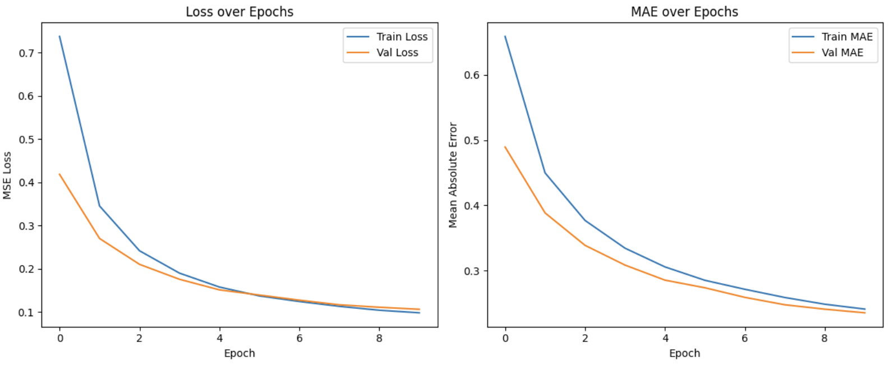

# Rosetta Stone 2

**Machine Learning**

**Luiss Guido Carli**

**Team Members:**  
- Daniele Biggi (793201)
- Ezgim Burcak Akseki (803311)
- Dionne Spaltman (Q00149)

Link to the sharepoint with the csv files: https://luiss-my.sharepoint.com/:f:/g/personal/dionne_spaltman_studenti_luiss_it/EiQz9X4xtYFCiIIqqVgeKJQBlsFhFWYNNqEzw2SiumfFHw?e=4BFULf 

---

## 1. Introduction

With this project, the aim was to build a model that is capable of determining how closely related two sentences are. This is also called a semantic similarity model. To do so, we used a dataset of one million sentence pairs. These served as the basis of our project. The first step in creating our model was to process these multilingual sentences. With the preprocessing we went from the input sentences to base sentences. The second step was to augment the dataset.  The third step was to build our models: we built one model based on a transformer architecture and one based on a Recurrent Neural Network architecture. Finally, we evaluated our model. 

### 1.1 Dataset Overview
The dataset that was provided, consisted of 5 columns (‘sentence1’, ‘sentence2’, ‘score’, ‘lang1’, lang2’) and 949,080 rows. An example of a sentence is ‘Ein Flugzeug hebt gerade ab.’ and its translation would be ‘An air plane is taking off.’ Each pair of sentences is assigned a score, varying from 0 to 5. 

### 1.2 Data Preprocessing
To be able to use our dataset for sentence similarity, we want to get the base form for each of the sentences. To do this, the following steps need to be performed: the text needs to be lowercase; punctuation and special characters need to be removed; sentences have to be tokenized; then we apply lemmatization; and finally stop words need to be removed (but only for languages where this makes sense).

More specifically, we started by loading the correct language models from Spacy. Stopwords are being sourced by the Spacy library, but for the Chinese language we had to import a list of Chinese stopwords and store them into a set. We imported the set from this GitHub: https://github.com/stopwords-iso/stopwords-zh/blob/master/stopwords-zh.json.

A function called “spacy_batch_tokenizer” was created. If the language was defined as Chinese, we tokenized the sentences by using the Jieba library. Then we would load the correct tokenizer based on the language and create an empty list with the end result. In a for loop we would then process the text in batches. The text was made all lowercase and stop words, punctuation and non-alphabetic characters would be excluded. Then the end result would be appended to the result list and finally the list of processed text would be returned. After doing this preparation work, the code was ready to be run by reading the data frame, setting a batch size and creating one last function to process the columns in language-specific batches. Again an empty results list was created and we would loop over each unique language in the specified language column. Only rows that correspond with the selected language would be selected and then the former function of cleaning and tokenizing the columns would be called. Because the Jieba library for Chinese cannot lemmatize sentences like any other language in the Spacy library, we decided to return the same Chinese words. The cleaned results are returned and added to the result list. Then we proceed by calling this function twice: once for first and once for the second language. We end up with a dataframe with 7 (cleaned versions of sentence 1 and 2 are added) columns instead of 5. 

### 1.3 Data Augmentation

The next task of the project was to augment the data. The goal with this was to enhance the dataset to improve the robustness of our models. We did this by using paragraphing techniques.  In order to do this we first created an empty dictionary to store our loaded models and tokenizers to reuse. Then a function was made to get the model and tokenizer for a specific language pair. If a model was already loaded, we could retrieve it from our dictionary, otherwise we would load the direction translation model using the MarianTokenizer and MarianMTModel. Then a function was written to translate a batch of texts from the source to the target language. An empty list with the translated texts was created and the tokenizer and model were retrieved using the function described earlier. Then in a for loop we would iterate over the input texts in sizes as defined by the batch size. First the texts are sliced so as to only contain the texts in the current batch. The batch is tokenized using the correct Marian tokenizer. In this step the results are converted into PyTorch tensors, padding ensures that all sequences have the same length and truncation set to True means that sequences that are too long get shortened. Then we run the translation model on the batch by using the generate function on our model. The function returns the translated sequences. Using our tokenizer the generated tokens are converted back into human-readable strings. The last line in this for loop extends the translated texts list with the decoded string. Furthemore, another function was created for the back translation. An empty list is created to store the results and a set of unique source languages from the input is created. The latter allows our function to process one language at a time. Then a for loop is started that iterates over the unique source languages. An intermediate language is set to translate through; for most languages this is English, except for English, Polish and Portuguese. These are translated through German. Then all indices and sentences that match the language are stored in a list, and duplicates are removed by using the set function. The source sentences are translated through the intermediate language and then translated back to the source. This gives us the back-translated version. Within the current for loop, another loop is made to ensure the original structure and number of sentences is preserved, since duplicates were removed a few lines ago. The back-translated sentences are attached to the original index, and the original order is restored. After defining our functions, it is time for the pipeline. It starts with a language code map and loading the preprocessed data. Any rows with missing values are dropped. The intermediate, so called pivot, language is defined to be English. All the first sentences are then gotten from the dataframe and stored in a list. Each language code from the dataframe is mapped to a language code. The back-translation is performed using our function and the results are stored in a new column in the dataframe. The same is done for the second sentence. Finally, the dataframe is stored which is now augmented with two new columns. 

In the second part of the data augmentation we will go from a dataframe with two extra columns, to a clean, ready-to-use dataset. The first step is that the code is mounted to our Google drive to access the files and it then loads our back-translated dataframe. Two copies are make then, one for sampling the original sentences (dataframe 1)  and one for injecting back-translated sentences into the clean columns (dataframe 4). In dataframe 4, the clean sentences are replaced by back-translated versions of it. Then we drop 50 percent of dataframe 1 and 1 percent of dataframe 4. Finally, the dataframes are concatenated, and we end up with a balanced dataset with mostly original examples with a small boost from paraphrased sentences. This final dataset is saved as our augmented dataset. 

### 1.4 Model Architecture
For this project, we made 5 models: a transformer-based model, a Recurrent Neural Network (RNN), a RNN with transformers that uses the embeddings created by Sentence Transformer, a Artificial Neural Network (ANN), and finally a ANN with transformers. 

---

## 2. Methods

Describe your proposed ideas (e.g., features, design choices, algorithm(s), training overview, etc.) and your environment so that:
- A reader can understand why you made your design decisions and the reasons behind any other choice related to the project.
- A reader should be able to recreate your environment (e.g., conda list, conda envexport, etc.)
- It may help to include a figure illustrating your ideas, e.g., a flowchart illustrating the steps in your machine learning system(s)

---

## 3. Experimental Design
Describe any experiments you conducted to demonstrate/validate the target contribution(s) of your project; indicate the following for each experiment:
- The main purpose: 1-2 sentence high-level explanation
- Baseline(s): describe the method(s) that you used to compare your work to.
- Evaluation Metrics(s): which ones did you use and why?

---

## 4. Results
- Main finding(s): report your results and what you might conclude from your work.
- Include at least one placeholder figure and/or table for communicating your findings.
- All the figures containing results should be generated from the code.

### 4.1 Results experiment 1: Comparison ANN vs ANN with transformer

### 4.2 Results experiment 2: Comparison RNN vs RNN with transformer

### 4.3 Results experiment 3: Comparison Transformer vs other models 

---

## 4. Conclusions

### Summary
- Summarize in one paragraph the take-away point from your work.

### Future Work
- Include one paragraph to explain what questions may not be fully answered by your work as well as natural next steps for this direction of future work.
